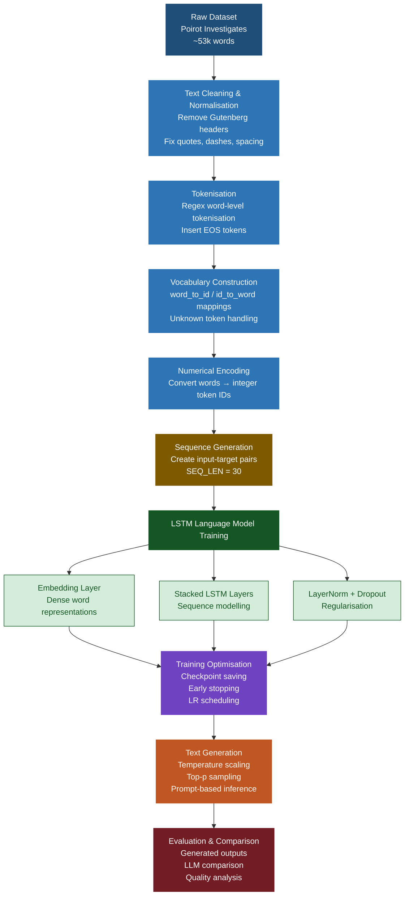

# 🕵️ Word-Level Language Model
### Agatha Christie Style Text Generation using TensorFlow LSTM

[](https://python.org)
[](https://tensorflow.org)
[](https://keras.io)
[](#)

---

## Overview

This project implements a **word-level language model** trained on *Poirot Investigates* by Agatha Christie using **TensorFlow/Keras**.

The model learns sequential word patterns from approximately **53,000 words** of detective fiction and generates new text in a style inspired by Agatha Christie.

Given a short prompt such as:

```text
Poirot looked at me and said
```

the model predicts the next sequence of words to generate coherent text.

---

## Final Results

| Metric | Result |
|---|---|
| Training Tokens | ~53,000 |
| Vocabulary Size | ~10k–12k |
| Model Type | Word-Level LSTM |
| Framework | TensorFlow/Keras |
| Sequence Length | 30 |
| Best Validation Loss | ~5.27 |
| Text Generation | ✅ Successful |
| Sampling Strategy | Top-p (Nucleus Sampling) |

> The final model successfully generated context-aware detective-style text using prompt-based inference.

---

## Demo Outputs

### Prompt 1

```text
Poirot looked at me and said
```

### Generated Output

```text
Poirot looked at me and said Poirot. I began to a few of the things were out of it. I was a small chest, and he had been across to them, and had out the good of the first of the road.
```

---

### Prompt 2

```text
Hastings, you must understand
```

### Generated Output

```text
Hastings, you must understand with a train in a situation. But the police were thrown across a small tent.
```

---

## Pipeline



---

## Model Architecture

The language model consists of:

- **Embedding Layer**
  - Learns dense vector representations for words

- **Stacked LSTM Layers**
  - Captures sequential dependencies and contextual patterns

- **Layer Normalisation**
  - Stabilises training

- **Dropout Regularisation**
  - Reduces overfitting

- **Dense Output Layer**
  - Predicts probability distribution across vocabulary

---

## Training Configuration

| Parameter | Value |
|---|---|
| Embedding Dimension | 128 |
| LSTM Units | 256 |
| Number of LSTM Layers | 2 |
| Batch Size | 64 |
| Sequence Length | 30 |
| Dropout | 0.3 |
| Optimiser | Adam |
| Learning Rate | 0.001 |
| Loss Function | Sparse Categorical Crossentropy |
| Epochs | 20 (Early Stopping Applied) |

---

## Text Generation Strategy

The model uses several decoding improvements to generate more natural text:

- **Temperature Scaling**
  - Controls randomness and creativity

- **Top-p (Nucleus) Sampling**
  - Samples only from the most probable tokens

- **Punctuation Limiting**
  - Prevents repetitive punctuation loops

- **EOS Token Stopping**
  - Allows cleaner sentence endings

---

## Comparison with Large Language Models

| Aspect | This Model | Large Language Models |
|---|---|---|
| Training Data | Single novel | Internet-scale datasets |
| Parameters | Small-scale | Billions of parameters |
| Coherence | Moderate | Very high |
| Grammar | Sometimes inconsistent | Highly accurate |
| Context Understanding | Limited | Strong |
| Style Mimicking | Good | Excellent |

### Key Insight

This project demonstrates how relatively small recurrent neural networks can still learn stylistic patterns and sentence structures from limited data, while modern transformer-based LLMs achieve superior coherence through massive datasets and scale.

---

## Tech Stack

| Category | Tools |
|---|---|
| Deep Learning | TensorFlow, Keras |
| NLP | Regex Tokenisation, Language Modelling |
| Data Processing | NumPy, JSON |
| Training | Google Colab |
| Visualisation | Matplotlib |
| Version Control | Git, GitHub |

---

## Project Structure

```text
.
├── notebook/
│   └── Language_Model_Poirot_Investigates.ipynb
│
├── checkpoints/
│   ├── best.weights.h5
│   └── config.json
│
├── outputs/
│   └── sample_outputs.txt
│
├── README.md
└── .gitignore
```

---

## Installation

```bash
git clone https://github.com/YOUR_USERNAME/agatha-christie-language-model.git

cd agatha-christie-language-model

pip install -r requirements.txt
```

---

## Running the Project

### 1. Open the notebook

```bash
notebook/language_model.ipynb
```

### 2. Run all notebook cells sequentially

### 3. Enter a prompt during inference

Example:

```text
Poirot looked at me and said
```

---

## Model Checkpoints

The trained model weights are stored in:

```text
checkpoints/best.weights.h5
```

These checkpoints are required for inference and text generation.

---

## Key Technical Highlights

- Built a complete **word-level NLP pipeline** from preprocessing to inference
- Implemented custom **tokenisation and vocabulary encoding**
- Trained a stacked **LSTM language model** using TensorFlow/Keras
- Applied **early stopping, checkpointing, and learning rate scheduling**
- Implemented **top-p nucleus sampling** for higher-quality generation
- Compared generated outputs with transformer-based LLMs such as ChatGPT

---

## Future Improvements

- Replace LSTM with Transformer architecture
- Train on multiple Agatha Christie novels
- Add Beam Search decoding
- Deploy as a web application
- Fine-tune larger language models

---

## Author

AJ  
MSc Artificial Intelligence / Data Science

---
his project is for educational and research purposes.
